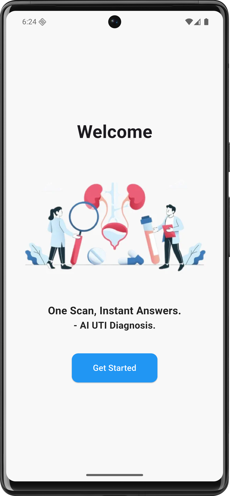
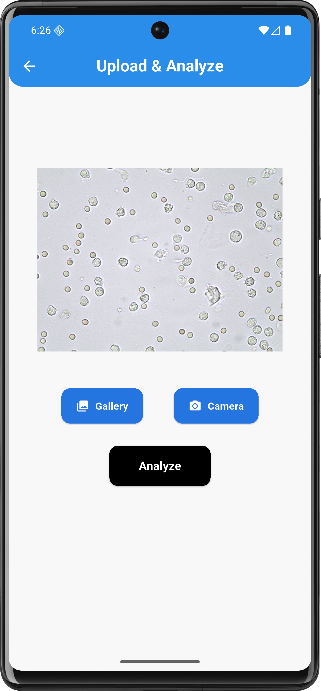
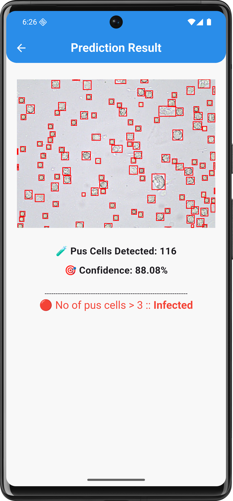

# UTI Detection YOLOv8

An AI-powered Flutter application for **urinary tract infection screening** from microscopy-style sample images.

The application performs on-device YOLOv8 TensorFlow Lite object detection, identifies pus-cell regions, applies non-maximum suppression, generates an annotated prediction image, counts detected pus cells, and reports an infection screening result using a simple count threshold inside a modern portfolio mobile interface.

> **Research Use Only:** This project is intended for educational and research screening demonstrations. It is not intended for clinical diagnosis, treatment planning, laboratory decision-making, or replacement of expert medical review.

---

## Preview

| Welcome | Image Upload | Prediction Result |
| --- | --- | --- |
|  |  |  |

## Project Highlights

- Built a complete Flutter flow for image selection, preview, YOLOv8 inference, and diagnosis output.
- Integrated local TensorFlow Lite inference so analysis runs on device without a remote API.
- Used YOLO-style object detection to identify pus cells and draw prediction boxes on the analyzed image.
- Applied non-maximum suppression to reduce duplicate detections before producing the final count.
- Converted detection count into a simple infection status using the app threshold of more than 3 pus cells.
- Kept the repository clean by excluding generated build artifacts and the trained model file.

## Tech Stack

- Flutter and Dart
- YOLOv8 model exported to TensorFlow Lite
- `tflite_flutter` for local model inference
- `image_picker` for gallery/camera input
- `image` for preprocessing and drawing bounding boxes
- Dart isolates for keeping heavy prediction work off the UI thread

## Repository Structure

- `lib/pages/` - welcome, upload, and prediction result screens
- `lib/utils/yolov8_helper.dart` - model loading, preprocessing, inference, NMS, and annotated output generation
- `assets/classes.txt` - detection class labels
- `assets/images/uti.png` - application visual asset
- `assets/models/best_float16.tflite` - local model file, excluded from Git because of size
- `screenshots/` - portfolio screenshots used in this README

## Run Locally

1. Install Flutter and confirm the environment with `flutter doctor`.
2. Install dependencies with `flutter pub get`.
3. Place the trained YOLOv8 TensorFlow Lite model at `assets/models/best_float16.tflite`.
4. Start the app with `flutter run`.

## Model Note

The trained `.tflite` model is about 21.7 MB, so it is intentionally excluded from the repository. Restore it locally at `assets/models/best_float16.tflite` before running inference.

## Diagnosis Note

The app uses detected pus-cell count as a screening signal: more than 3 detected pus cells is shown as infected, while 3 or fewer is shown as not infected. This project is intended as a software prototype, not a replacement for clinical diagnosis.
